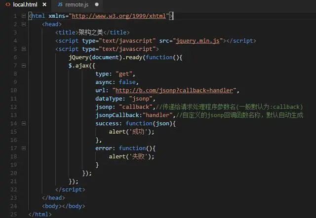

# JSONP的原理：
> 由于同源策略不会阻止动态脚本的插入到文档中去，所以催生出了一种很常用的跨域方式： JSONP(JSON with Padding)。

原理说起来也很简单：

假设，我们源页面是在a.com,想要获取b.com的数据，我们可以动态插入来源于b.com 的脚本:
```js
script=document.createElement("script");  
script.type="text/javascript";  
script.src="http://www.b.com/getdata?callback=demo";  
function demo(data) {  
  console.log(data.msg);  
}
```
这里，我们利用动态脚本的src属性，变相地发送了一个`http://www.b.com/getdata?callback=demo`的GET请求。**这时候，b.com页面接受到这个请求时，利用JSONP,服务端会接受这个callback参数，然后用这个参数值包装要返回的数据，像这样：**

`demo({msg:"helloworld"});`
这时候，如果a.com的页面上正好有一个demo 的函数：

```js
function demo(data) {  
  console.log(data.msg);  
} 
```
当远程数据一返回的时候，随着动态脚本的执行，这个demo函数就会被执行。

到这里，你应该能明白这个技术为什么叫JSONP了吧？**就是因为使用这种技术服务器会接受回调函数名作为请求参数，并将JSON数据填充进回调函数中去。**

## JSONP的缺点：

- 1.首先，它没有关于JSONP调用的错误处理，一旦回调函数调用失败，浏览器会以静默失败的方式处理。
- 2.其次，它只支持GET请求，这是由于该技术本身的特性所决定的。因此，对于一些需要对安全性有要求的跨域请求，JSONP的使用需要谨慎一点了。
- 3.JSONP不支持用async:false的方法设置同步。

## JSONP的优点：
由于JSONP对于老浏览器兼容性方面比较良好，因此，对于那些对IE8以下仍然需要支持的网站来说，仍然被广泛应用。不过，针对高级浏览器，建议还是用CORS方法。



