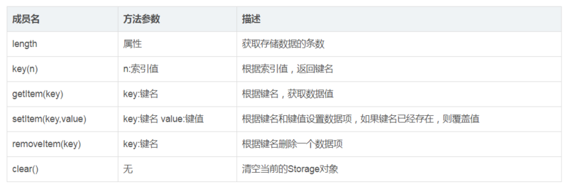
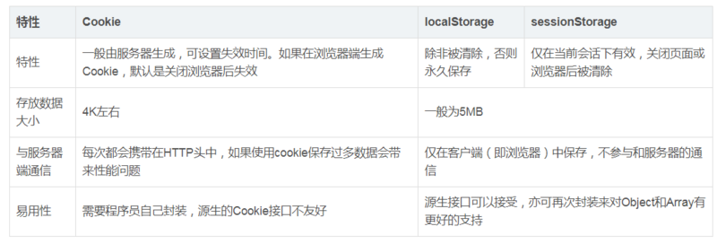

# Cookie、session和localStorage、以及sessionStorage之间的区别

## 一、Cookie、session和localStorage的区别 

cookie的内容主要包括：名字、值、过期时间、路径和域。路径与域一起构成cookie的作用范围。若不设置时间，则表示这个cookie的生命期为浏览器会话期间，关闭浏览器窗口，cookie就会消失。这种生命期为浏览器会话期的cookie被称为会话cookie。 
会话cookie一般不存储在硬盘而是保存在内存里，当然这个行为并不是规范规定的。若设置了过期时间，浏览器就会把cookie保存到硬盘上，关闭后再打开浏览器这些cookie仍然有效直到超过设定的过期时间。对于保存在内存里的cookie，不同的浏览器有不同的处理方式session机制。 
当程序需要为某个客户端的请求创建一个session时，服务器首先检查这个客户端的请求里是否已包含了一个session标识（称为session id），如果已包含则说明以前已经为此客户端创建过session，服务器就按照session id把这个session检索出来使用（检索不到，会新建一个），如果客户端请求不包含session id，则为客户端创建一个session并且生成一个与此session相关联的session id，session id的值应该是一个既不会重复，又不容易被找到规律以仿造的字符串，这个session id将被在本次响应中返回给客户端保存。保存这个session id的方式可以采用cookie，这样在交互过程中浏览器可以自动的按照规则把这个标识发送给服务器。

## 二、cookie和session的区别

1、cookie数据存放在客户的浏览器上，session数据放在服务器上 
2、cookie不是很安全，别人可以分析存放在本地的cookie并进行cookie欺骗，考虑*到安全应当使用session 
3、session会在一定时间内保存在服务器上，当访问增多，会比较占用你服务器的性能，考虑到减轻服务器性能方面，应当使用cookie 
4、单个cookie保存的数*据不能超过4K，很多浏览器都限制一个站点最多保存20个cookie 
5、建议将登录信息等重要信息存放为session，其他信息如果需要保留，可以放在cookie中 
6、session保存在服务器，客户端不知道其中的信心；cookie保存在客户端，服务器能够知道其中的信息 
7、session中保存的是对象，cookie中保存的是字符串 
8、session不能区分路径，同一个用户在访问一个网站期间，所有的session在任何一个地方都可以访问到，而cookie中如果设置了路径参数，那么同一个网站中不同路径下的cookie互相是访问不到的。 
9、COOKIE:是服务端向客户端写入的小的片段信息。cookie信息保存在服务器缓存区，不会在客户端显现。当你第一次登陆一个网站，服务器向你的机器写得片段信息。你可以在Internet选项中找到存放cookie的文件夹。如果不删除，cookie就一直在这个文件夹中。 
10、session需要借助cookie才能正常工作。如果客户端完全禁止cookie，session将失效。 但是如果服务器端启用了url编码，也就是用 URLEncoder.encode()把所有的url编码了，则会在url后面出现如下类似的东西 index.jsp:jsessionid=fdsaffjdlks;jaf;lkdjsf 服务器通过这个进行session的判断. 
11.Cookie支持跨域名访问，例如将domain属性设置为“.biaodianfu.com”，则以“.biaodianfu.com”为后缀的一切域名均能够访问该Cookie。跨域名Cookie如今被普遍用在网络中，例如Google、Baidu、Sina等,而Session则不会支持跨域名访问。Session仅在他所在的域名内有效。仅运用Cookie或者仅运用Session可能完成不了理想的效果。这时应该尝试一下同时运用Cookie与Session。Cookie与Session的搭配运用在实践项目中会完成很多意想不到的效果。

## 三、web Storage和Cookie的区别 
Web Storage的概念和cookie相似，区别是它是为了更大容量存储设计的，cookie的大小是受限的，并且每次请求一个新的页面的时候cookie都会被发送过去，这样无形中浪费了带宽，另外cookie还需要指定作用域，不可跨域调用。 
除此之外，web storage拥有setItem,getItem,removeItem,clear等方法，不像cookie需要前端开发者自己封装setCookie，getCookie。 
但是cookie也是不可或缺的，cookie的作用是与服务器进行交互，作为http规范的一部分而存在的，而web Storage仅仅是为了在本地“存储”数据而生 
sessionStorage、localStorage、cookie都是在浏览器端存储的数据，其中sessionStorage的概念很特别，引入了一个“浏览器窗口”的概念，sessionStorage是在同源的同窗口中，始终存在的数据，也就是说只要这个浏览器窗口没有关闭，即使刷新页面或进入同源另一个页面，数据仍然存在，关闭窗口后，sessionStorage就会被销毁，同时“独立”打开的不同窗口，即使是同一页面，sessionStorage对象也是不同的

Web Storage带来的好处： 
1、减少网络流量：一旦数据保存在本地之后，就可以避免再向服务器请求数据，因此减少不必要的数据请求，减少数

据在浏览器和服务器间不必要的来回传递 
2、快速显示数据：性能好，从本地读数据比通过网络从服务器上获得数据快得多，本地数据可以及时获得，再加上网

页本身也可以有缓存，因此整个页面和数据都在本地的话，可以立即显示 
3、临时存储：很多时候数据只需要在用户浏览一组页面期间使用，关闭窗口后数据就可以丢弃了，这种情况使用sessionStorage非常方便

## 四、浏览器本地存储与服务器端存储的区别 
其实数据既可以在浏览器本地存储，也可以在服务器端存储 
浏览器可以保存一些数据，需要的时候直接从本地存取，sessionStorage、localStorage和cookie都是由浏览器存储在本地的数据 
服务器端也可以保存所有用户的所有数据，但需要的时候浏览器要向服务器请求数据。 
1、服务器端可以保存用户的持久数据，如数据库和云存储将用户的大量数据保存在服务器端 
2、服务器端也可以保存用户的临时会话数据，服务器端的session机制，如jsp的session对象，数据保存在服务器上，

实际上，服务器和浏览器之间仅需传递session id即可，服务器根据session id找到对应用户的session对象，会话数据仅在一段时间内有效，这个时间就是server端设置的session有效期

服务器端保存所有的用户的数据，所以服务器端的开销较大，而浏览器端保存则把不同用户需要的数据分别保存在用户各自的浏览器中，浏览器端一般只用来存储小数据，而非服务可以存储大数据或小数据服务器存储数据安全一些，浏览器只适合存储一般数据

## 五、sessionStorage、localStorage和cookie的区别 
共同点：都是保存在浏览器端、且同源的 
区别： 
1、cookie数据始终在同源的http请求中携带（即使不需要），即cookie在浏览器和服务器间来回传递，而sessionStorage和localStorage不会自动把数据发送给服务器，仅在本地保存。cookie数据还有路径（path）的概念，可以限制cookie只属于某个路径下 
2、存储大小限制也不同，cookie数据不能超过4K，同时因为每次http请求都会携带cookie、所以cookie只适合保存很小的数据，如会话标识。sessionStorage和localStorage虽然也有存储大小的限制，但比cookie大得多，可以达到5M或更大 
3、数据有效期不同，sessionStorage：仅在当前浏览器窗口关闭之前有效；localStorage：始终有效，窗口或浏览器关闭也一直保存，因此用作持久数据；cookie：只在设置的cookie过期时间之前有效，即使窗口关闭或浏览器关闭 
4、作用域不同，sessionStorage不在不同的浏览器窗口中共享，即使是同一个页面；localstorage在所有同源窗口中都是共享的；cookie也是在所有同源窗口中都是共享的 
5、web Storage支持事件通知机制，可以将数据更新的通知发送给监听者 
6、web Storage的api接口使用更方便

## 六、sessionStorage与页面js数据对象的区别 
页面中一般的js对象的生存期仅在当前页面有效，因此刷新页面或转到另一页面这样的重新加载页面的情况，数据就不存在了 
而sessionStorage只要同源的同窗口中，刷新页面或进入同源的不同页面，数据始终存在，也就是说只要浏览器不关闭，数据仍然存在

# 【 请描述一下cookies，sessionStorage和localStorage的区别？】

1.背景介绍

SessionStorage, LocalStorage, Cookie这三者都可以被用来在浏览器端存储数据，而且都是字符串类型的键值对。 区别在于前两者属于WebStorage，创建它们的目的便于客户端存储数据。 而Cookie早在网景公司的浏览器中就开始支持，最初目的是为了保持HTTP的状态。

 

Cookie（也叫Web cookie或者浏览器Cookie）是服务器发送到用户浏览器并保存在浏览器上的一块数据， 它会在浏览器下一次发起请求时被携带并发送到服务器上。比较经典的，可以它用来确定两次请求是否来自于同一个浏 览器，从而能够确认和保持用户的登录状态。Cookie的使用使得基于无状态的HTTP协议上记录稳定的状态信息成为了可能。

localStorage 是 HTML5 标准中新加入的技术，它并不是什么划时代的新东西。 早在 IE 6 时代，就有一 个叫 userData 的东西用于本地存储，而当时考虑到浏览器兼容性， 更通用的方案是使用 Flash。而如今，localStorage 被大多数浏览器所支持，更多用他来存储数据。

sessionStorage 与 localStorage 的接口类似， 但保存数据的生命周期与 localStorage 不同。 做过后 端开发的同学应该知道 Session 这个词的意思， 直译过来是“会话”。 而 sessionStorage 是一个前端的概念， 它只 是可以将一部分数据在当前会话中保存下来， 刷新页面数据依旧存在。 但当页面关闭后，sessionStorage 中的数据就会被清空

2.知识剖析
在同一个页面中设置 Cookie，实际上是按从后往前的顺序进行的。如果要先删除一个 Cookie，再写入一 个 Cookie，则必须先写入语句，再写删除语句，否则会出现错误Cookie是面向路径的。缺省路径 (path) 属性时 ，Web 服务器页会自动传递当前路径给浏览器，指定路径强制服务器使用设置的路径。在一个目录页面里设置的 Cookie 在另一个目录的页面里是看不到的Cookie 必须在 HTML 文件的内容输出之前设置；不同的浏览器 对 Cookie 的处理不一致，使用时一定要考虑；客户端用户如果设置禁止 Cookie，则 Cookie 不能建立。并且在客户端， 一个浏览器能创建的 Cookie 数量最多为 300 个，并且每个不能超过 4KB，每个 Web 站点能设置的 Cookie 总数不能超过 20 个

cookie的设置以及发送过程分为以下四步：

客户端发送一个http请求到服务器端

服务器端发送一个http响应到客户端，其中包含Set-Cookie头部

客户端发送一个http请求到服务器端，其中包含Cookie头部

服务器端发送一个http响应到客户端

Storage类的相关成员

三者之间的区别对比：

特性 Cookie localStorage sessionStorage
特性 一般由服务器生成，可设置失效时间。如果在浏览器端生成Cookie，默认是关闭浏览器后失效 除非被清除，否则永久保存 仅在当前会话下有效，关闭页面或浏览器后被清除
存放数据大小 4K左右 一般为5MB
与服务器端通信 每次都会携带在HTTP头中，如果使用cookie保存过多数据会带来性能问题 仅在客户端（即浏览器）中保存，不参与和服务器的通信
易用性 需要程序员自己封装，源生的Cookie接口不友好 源生接口可以接受，亦可再次封装来对Object和Array有更好的支持
3.常见问题
 

COOKIE是如何工作的？

 

4.解决方案
 

COOKIE是如何工作的？

 

Cookie可用于客户端数据的存储，在没有其它存储办法时，使用这种方式是可行的，但随着现在浏览器开始支持各种各样 
的存储方式而逐渐被废弃。 由于服务器指定Cookie以后浏览器的每次请求都会携带Cookie数据，这会带来额外的性能负 
担（尤其是在移动环境下）。 新的浏览器API已经允许开发者直接在本地存储数据，如可以使用Web storage API （本地 
存储和会话存储）和IndexedDB（索引数据库）。 

COOKIE主要用在以下三个方面:

会话状态管理（如用户登录状态、购物车） 
个性化设置（如用户自定义设置） 
浏览器行为跟踪（如跟踪分析用户行为）

5.编码实战
6.扩展思考
三者的用途差异？

例如：曾经使用 Cookie 来保存用户在电商网站的购物车信息，如今有了 localStorage，Cookie就退休了。还有像一些 网页游戏会产生一些本地数据，也使用LocalStorage。但如果需要拆分页面，会跳转多个子页面的时候，就需要用到sessionStorage。

COOKIE的缺陷

每个 HTTP 请求中都包含 Cookies，从而导致传输相同的数据减缓我们的 Web 应用程序。 
每个 HTTP 请求中都包含 Cookies，从而导致发送未加密的数据到互联网上，可能会导致数据泄露，虽然进行过加密，但是攻击者拿到cookie后仍然可以登录，因为难以识别是否为同一个用户在登陆。 
Cookies 只能存储有限的 4KB 数据，对于复杂的存储需求来说是不够用的。

7.参考文献
参考资料：https://www.cnblogs.com/zr123...

—— Cookie、session和localStorage、以及sessionStorage之间的区别

参考资料：https://www.cnblogs.com/minig...

—— JS 详解 Cookie、 LocalStorage 与 SessionStorage

 

8.更多讨论
 

如何优化cookie？

关于安全性的考虑？

9.互动提问
sessionStroage有哪些应用场景？ 
答： 在不需要和服务器交互的场所，用来存储用户数据之类的，可以在路由页跳转的时候取出更改储存，减少调用接口的次数，减轻服务器压力。

用storage怎么来判断用户是否需要再登陆？ 
答：可以用加密的方法存储，每次用户访问的时候可以取出调用服务器接口作为参数发送进行对比，存在账号密码就直接跳过登录页。

localStorage是否可以在同源窗口共享？ 
答：同一浏览器的相同域名和端口的不同页面间可以共享相同的 localStorage，但是不同页面间无法共享sessionStorage的信息。