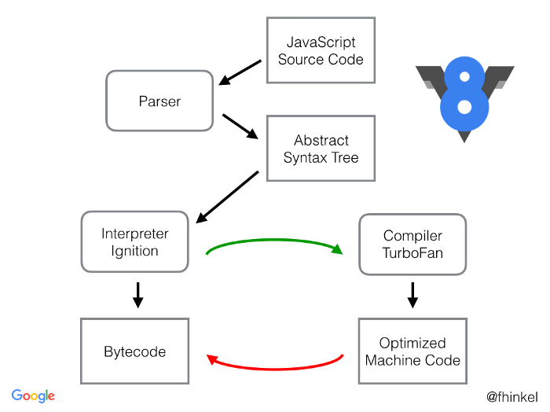

# 关于浏览器引擎

## JavaScript深入浅出第4课：V8引擎是如何工作的？

https://blog.fundebug.com/2019/07/16/how-does-v8-work/

### V8引擎的内部结构
V8是一个非常复杂的项目，使用cloc统计可知，它竟然有超过100万行C++代码。

**V8由许多子模块构成，其中这4个模块是最重要的：**

- Parser：负责将JavaScript源码转换为Abstract Syntax Tree (AST)
- Ignition：interpreter，即解释器，负责将AST转换为Bytecode，解释执行Bytecode；同时收集TurboFan优化编译所需的信息，比如函数参数的类型；
- TurboFan：compiler，即编译器，利用Ignitio所收集的类型信息，将Bytecode转换为优化的汇编代码；
- Orinoco：garbage collector，垃圾回收模块，负责将程序不再需要的内存空间回收；


其中，Parser，Ignition以及TurboFan可以将JS源码编译为汇编代码，其流程图如下：


简单地说，Parser将JS源码转换为AST，然后Ignition将AST转换为Bytecode，最后TurboFan将Bytecode转换为经过优化的Machine Code(实际上是汇编代码)。

如果函数没有被调用，则V8不会去编译它。
如果函数只被调用1次，则Ignition将其编译Bytecode就直接解释执行了。TurboFan不会进行优化编译，因为它需要Ignition收集函数执行时的类型信息。这就要求函数至少需要执行1次，TurboFan才有可能进行优化编译。
如果函数被调用多次，则它有可能会被识别为热点函数，且Ignition收集的类型信息证明可以进行优化编译的话，这时TurboFan则会将Bytecode编译为Optimized Machine Code，以提高代码的执行性能。
图片中的红线是逆向的，这的确有点奇怪，Optimized Machine Code会被还原为Bytecode，这个过程叫做Deoptimization。这是因为Ignition收集的信息可能是错误的，比如add函数的参数之前是整数，后来又变成了字符串。生成的Optimized Machine Code已经假定add函数的参数是整数，那当然是错误的，于是需要进行Deoptimization。
```js
function add(x, y) {
    return x + y;
}

add(1, 2);
add("1", "2");
```

在运行C、C++以及Java等程序之前，需要进行编译，不能直接执行源码；但对于JavaScript来说，我们可以直接执行源码(比如：node server.js)，它是在运行的时候先编译再执行，这种方式被称为即时编译(Just-in-time compilation)，简称为JIT。因此，V8也属于JIT编译器。


###  Ignition

不难发现，Bytecode某种程度上就是汇编语言，只是它没有对应特定的CPU，或者说它对应的是虚拟的CPU。这样的话，生成Bytecode时简单很多，无需为不同的CPU生产不同的代码。要知道，V8支持9种不同的CPU，引入一个中间层Bytecode，可以简化V8的编译流程，提高可扩展性。

如果我们在不同硬件上去生成Bytecode，会发现生成代码的指令是一样的：

### TurboFan：编译器
当然，TurboFan所做的也不只是根据类型信息来简化代码执行流程，它还会进行其他优化，比如减少冗余代码等更复杂的事情。

由这个简单的例子可知，如果我们的JS代码中变量的类型变来变去，是会给V8引擎增加不少麻烦的，为了提高性能，我们可以尽量不要去改变变量的类型。

对于性能要求比较高的项目，使用TypeScript也是不错的选择，理论上，如果严格遵守类型化的编程方式，也是可以提高性能的，类型化的代码有利于V8引擎优化编译的汇编代码，当然这一点还需要测试数据来证明。

### Orinoco：垃圾回收

### JS引擎的未来
V8引擎确实很强大，但是它也不是无所不能的，简单地分析都可以发现一些可以优化的点。

我有一个新的想法，还没想好名字，不妨称作Optimized TypeScript Engine：

- 使用TypeScript编程，遵循严格的类型化编程规则，不要写成AnyScript了；
- 构建的时候将TypeScript直接编译为Bytecode，而不是生成JS文件，这样运行的时候就省去了Parse以及生成Bytecode的过程；
- 运行的时候，需要先将Bytecode编译为对应CPU的汇编代码；
- 由于采用了类型化的编程方式，有利于编译器优化所生成的汇编代码，省去了很多额外的操作；

这个想法其实可以基于V8引擎来实现，技术上应该是可行的：

- 将Parser以及Ignition拆分出来，用于构建阶段；
- 删掉TurboFan处理JS动态特性的相关代码；

这样做，可以将JS引擎简化很多，一方面不再需要parse以及生成bytecode，另一方面编译器不再需要因为JavaScript动态特性做很多额外的工作。因此可以减少CPU、内存以及电量的使用，优化性能，唯一的问题可能是必须使用严格的TS语法进行编程。

为啥要这样做呢？因为对于IOT硬件来说，CPU、内存、电量都是需要省着点用的，不是每一个智能家电都需要装一个骁龙855，如果希望把JS应用到IOT领域，必然需要从JS引擎角度去进行优化，只是去做上层的框架是没有用的。

其实，Facebook的Hermes差不多就是这么干的，只是它没有要求用TS编程。

这应该是JS引擎的未来，大家会看到越来越多这样的趋势。