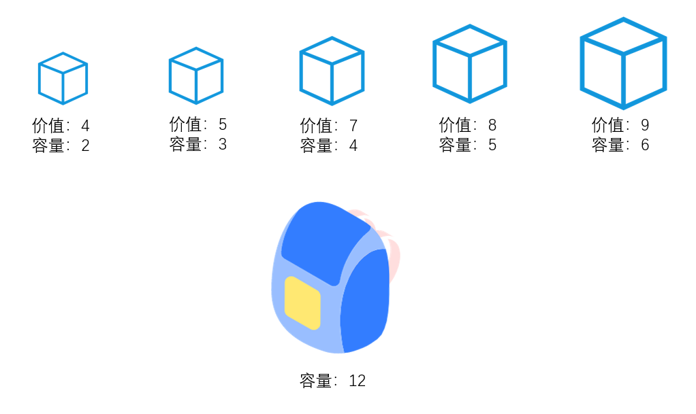

# 0-1背包问题 {ignore}

## 问题描述

有n个物品，它们有各自的体积和价值，现有给定容量的背包，如何让背包里装入的物品具有最大的价值总和？



对于每一件物品，可以有不拿(0)和拿(1)两种选择，因此该问题通常称之为“0-1背包问题”

“0-1背包问题”需要使用**递归**求解

## 递归 

递归（recursive）是指某个函数在执行过程中直接或间接的调用自身

```js
function A(){
    //...
    A(); //产生递归
}
```

如何理解递归的函数调用呢？

每一次函数调用，JS会创建一个执行上下文，并放置到执行栈中执行。

- **执行上下文**：每当**调用**一个函数，会创建一个该函数的执行上下文，上下文中包含该函数的相关参数、变量
- **执行栈**：执行上下文会放置到执行栈中[^1]，每当执行上下文创建时，会进入执行栈；每当函数调用完成后，会从执行栈中移除。在刚开始执行JS时，会创建一个全局上下文。

例如下面的代码：

```js {.line-numbers}
function test(n){
    if(n <= 1) {
        return 1;
    }
    return n * test(n - 1);
}
test(3);
```

整个的执行过程见ppt

理解执行栈，最重要的是理解**每次函数的执行是独立的、互不干扰的**，哪怕调用的是同一个函数。

有些时候，使用递归可以让我们用极其简洁的代码来表达程序逻辑，例如上面的代码，就是求阶乘的函数。

使用递归时，要注意函数的终止，否则将导致无限递归，从而使执行栈溢出。

## 背包问题的代码实现


**物品如何表示？**

```js
var objects = [
    { value: 4, volume: 2 }, //物品对象，value表示价值，volume表示体积
    { value: 5, volume: 3 },
    { value: 7, volume: 4 },
    { value: 8, volume: 5 },
    { value: 9, volume: 6 }
];
```

**实现函数如何表示？**

```js
/**
 * 求解背包问题
 * @param capacity 背包容量，例：12
 * @param objects 可选物品
 * @return 求解结果，一个对象，包含3个信息：1. 选择的物品数组   2. 总价值  3. 总占用空间
 * 例如： {
 *      objects: [{ value: 4, volume: 2 }, { value: 5, volume: 3 }],
 *      value: 9,
 *      volume: 5
 * }
 */
function getMaxValue(capacity, objects){

}
```

**如何实现？**

1. 特殊情况： 没有可选物品
2. 普通情况： 要将问题转换为 是否要选择第一件物品 的问题

```js
if(第一件物品装不下){
    return 同样的空间装剩余物品;
}
var result1 = 装第一件物品的结果;
var result2 = 不装第一件物品的结果;
if(result1.value > result2.value){ //比较总价值
    return result1;
}
else{
    return result2;
}
```