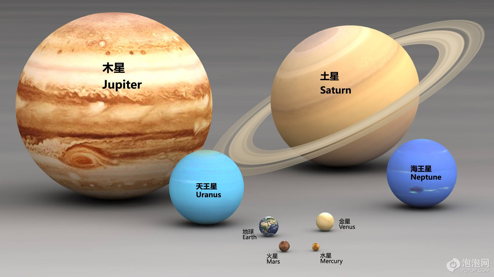

# 图片元素

## img元素

img缩写，空元素

- src属性：source，资源：表示路径

- alt属性:当图片失效时，将使用该属性的文字代替图片

## 和a元素联用

## 和map元素

map:地图

使用map子元素area划分区域

衡量坐标时，为了测量精确，需要使用专业做图软件

ps，pxbook

## 和figure元素联用

指代、定义，通常用于把对图片的标题描述包裹起来(语义化)

子元素：figcaption