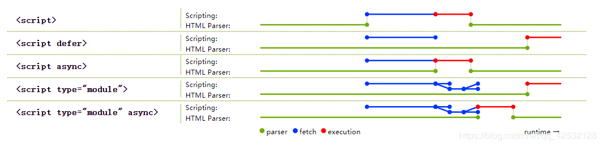

# JS加载时间线

## 其实DOM节点可以分为 可视化节点 和 非可视化节点，

> 像 div、p 等这种结构性的标签节点可被称为可视化节点，
而 **script、meta 等这种在页面上显示不出来的节点则被称为非可视化节点；**

### 那渲染树(render树)是什么呢？

### 浏览器是如何渲染 UI 的？

1. 浏览器获取 HTML 文件，然后对文件进行解析，形成 DOM Tree
2. 与此同时，进行 CSS 解析，生成 Style Rules
3. 接着将 DOM Tree 与 Style Rules 合成为 Render Tree
4. 元素在页面中布局，然后绘制
- render 树就是根据 **可视化节点 和 css 样式表** 结合诞生出来的树；

注意：PS: display: none 的元素会出现在 DOM树 中，但不会出现在 render 树中；

## js的script标签到底是放在head还是body中？

https://www.jianshu.com/p/2e6f9b732a91

- js可以分为外部的和内部的。
**外部的js一般放到head内,或者在任意位置用src引入**

### 内部的js
内部的js也叫本页面的JS脚本，
内部的js一般放到body内，这样做的目的有很多，

1. 不阻塞页面的加载(事实上js会被缓存)；
2. **可以直接在js里操作dom，这时候dom是准备好的，即保证js运行时dom是存在的。**
3. '猫头鹰书'建议的方式是放在页面底部，监听window.onload 或 readystate 来触发js

延伸：
> head内的js会阻塞页面的传输和页面的渲染

head 内的 JavaScript 需要执行结束才开始渲染 body，所以尽量不要将 JS 文件放在 head 内。可以选择在 document 完成时，或者特定区块后引入和执行 JavaScript。

而 CSS 应当写在 head 中，以避免页面元素由于样式缺失造成瞬间的白页或者给用户闪烁感。 ---吴钊

- 所以在head内的js一般要先执行完后，才开始渲染body页面。为了避免head引入的js脚本阻塞浏览器中主解析引擎对dom的解析工作，对dom的渲染，一般原则是，样式在前面，dom文档，脚本在最后面。遵循先解析再渲染再执行script这个顺序。

参考网站:https://blog.csdn.net/qq_42532128/article/details/102979020
## js时间线
- 根据JS出生的那一刻开始,记录的一系列浏览器按照顺序做的事儿

1. 创建Document对象,开始解析web页面. 解析HTML元素和他们的文本内容后,添加Element对象和Text节点到文档中.这个阶段document.readyState = 'loading'。

2. 遇到link外部css,创建线程加载,并继续解析文档.

3. 遇到script外部js,并且**没有设置async、defer,那么浏览器加载、并阻塞**,等待js加载完成并执行该脚本,然后继续解析文档.

4. 遇到script外部js,并且设置有async、defer,那么浏览器创建新线程异步加载,并继续解析文档,不会阻塞.
**对于async属性的脚本，脚本加载完成后立即执行. 异步禁止使用document.write();-->消除文档流**

5. 遇到img等,先正常解析dom结构,然后浏览器异步加载src,并继续解析文档.

6. 当**文档解析完成,document.readyState = 'interactive';**

7. **文档解析完成后,所有设置有defer的脚本会按照顺序执行.**
注意与async的不同,但**同样禁止使用document.write();**

8. document对象触发DOMContentLoaded事件,这也标志着程序执行从同步脚本执行阶段,转化为事件驱动阶段.
- **只能这么用:document.addEventListener('DOMContentLoaded',function(){},false);才行**
- 就是可以去监听事件了

9. 当所有async的脚本加载完成并执行后、img等加载完成后,document.readyState = 'complete',window对象触发load事件.

10. 从此,以异步响应方式处理用户输入、网络事件等。

### ps:尽量在最后使用window.onload;

1. load事件我们知道，在window上有这个事件window.onload  这个事件是在dom文档完全渲染完毕之后才会触发,
如果网速不好的时候，有那么一丁点的数据没有加载完成，这个事件就不会执行，这是一个非常拖浏览器后腿的事件

2. 而DOMContentLoaded则不同了，这个事件表示的是当Dom解析完毕之后执行，没有浪费浏览器运行效率，但是
这个事件只能用addEventListener绑定。但这也不是个问题，所以，当我们在head标签里面写Javascript语句的时候
用这个事件，千万不要用load了。

## 阻塞过程：

>浏览器遇到<script>标签时，会唤醒JavaScript解释器，暂停HTML的解析，等到CSSOM构建完成（如果有的话），开始执行JavaScript脚本，JavaScript执行完毕后继续解析HTML。也就是说，浏览器会等待JavaScript资源下载完毕并执行完毕后才会继续解析HTML。

>这时，我们就会发现一个矛盾。JavaScript是无法操作位于它下方的DOM的，因为此时DOM还没有构建出来。因此最好将<script>放在<body>之后，也就是等到所有的HTML都解析完成之后，再进行JavaScript的相关操作。而CSS会阻塞JavaScript的执行，因此CSS资源应优先于JavaScript资源被引入。

>ps：由于JavaScript在操作DOM时，可能会引起浏览器的回流（reflow）或重绘（repaint），影响页面渲染性能，因此应该尽可能避免用JavaScript操作DOM。

## JavaScript代码编写建议

最后，根据以上描述，对于javaScript代码编写给出几点建议：

把全部JavaScript引入放到body元素中页面内容的后面
最好只包含一个延迟脚本
将延迟脚本也放在页面底部
将样式文件放在JavaScript之前（将css放在头部）