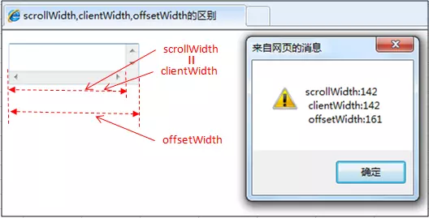
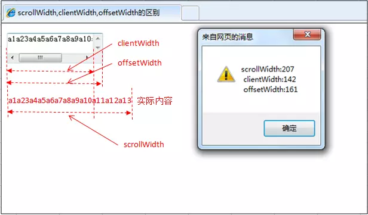

# scrollWidth、clientWidth、offsetWidth、width的区别

参考网站:https://www.jianshu.com/p/76ba0d71bd7c

- scrollWidth：对象的实际内容的宽度，不包边线宽度，会随对象中内容超过可视区后而变大。
- 
- clientWidth：对象内容的可视区的宽度，不包滚动条等边线，会随对象显示大小的变化而改变。
- 
- offsetWidth：对象整体的实际宽度，包滚动条等边线，会随对象显示大小的变化而改变。
- 
- innerWidth：
window.innerHeight=浏览器窗口的内部高度
window.innerWidth=浏览器窗口的内部宽度

## 例子 textarea

1. 元素内无内容或者内容不超过可视区，滚动不出现或不可用的情况下。
scrollWidth=clientWidth，两者皆为内容可视区的宽度。
offsetWidth为元素的实际宽度。

2. 元素的内容超过可视区，滚动条出现和可用的情况下。
scrollWidth>clientWidth。
scrollWidth为实际内容的宽度。
clientWidth是内容可视区的宽度。
offsetWidth是元素的实际宽度。

3. offsetWidth和width区别
offsetWidth属性可以返回对象的padding+border+元素width属性值之和，style.width返回值就是定义的width属性值。
offsetWidth属性仅是可读属性，而style.width是可读写的。
offsetWidth属性返回值是整数，而style.width的返回值是字符串，并且带有单位。

4. style.width仅能返回以style方式定义的内部样式表的width属性值。
