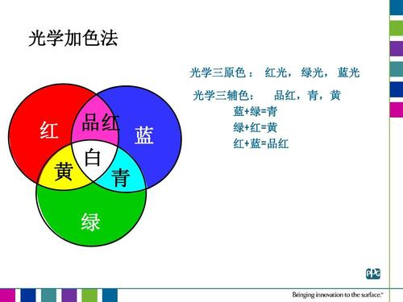

# css属性

## 字体

1. font-size:设置的是字体的相对大小,且设置的是 **高度**,Chrome,默认是16px
2. font-weight:**normal==400,bold==700**总共有:lighter,normal,bold,bolder(strong和b标签的作用)
-   100 ~ 900 , 间隔为100,没有单位。 字体能否被加的更粗取决于字体包的规定,所有有时lighter、bolder无效
3. font-style:需要记得就是italic值,代表斜体
4. font-family:arial(记这个,苹果公司的字体,整个互联网都有用,其实Helvetica才是arial的正主)
- 大多种类是给英文设置的
5. color;没有font-color这个说法
- 土鳖式:英文单词
- 颜色代码:#ff4400,淘宝红,投票选的,人家研究了很久的. transparent:透明色
- **颜色函数(光学三原色:红绿蓝,红+绿+蓝==白色):rgb();而美术三原色是红黄蓝**

6. border-style:dashed条状虚线,dotted点状虚线
- **一旦border的边线,粗到重合,那么谁都别想占便宜,咱们平分！**

## 文本

1. 对齐方式text-align:center(水平居中),left,right
2. 单行文本高度line-height:
3. **首行文本缩进text-indent:2em;1em = 1*font-size** 
4. px:每英寸所能容纳的垂直像素点数。  **像素其实是相对单位**
5. del标签:一般不用,因为一旦HTML的某个标签过多的掺杂了css样式,那我就尽量不用你这个标签,因为不易修改
6. text-decoration:line-through;中划线;underline是下划线;overline是上划线;none无样式
7. cursor:pointer鼠标变为小手;help(?),w-resize(箭头),e-resize,copy

### 居中

1. **单行文本垂直居中: height == line-height**
- 第二种是利用padding
2. 水平居中:text-align:center;

## 行、块 盒

### 行级元素/内联元素inline(现在叫行盒W3C,下同)
- css的feature:*内容决定元素所占位置,不可以通过css改变宽高*
- 真正的(不可通过css改变的)html的feature:
- span、strong、em、a、del

### 块级元素block(现在叫块盒)
- feature:*独占一行,可以通过css改变宽高*
- 真正的html的feature:
- div、p、ul、li、ol、form、addre

### 行级块元素inline-block(现在叫行块盒)

- feature:*内容决定大小,但是可以改变宽高.*
- 真正的html的feature:
- **img:img的宽高可以只设置其中一个,另外一个就会等比例缩放**

- *凡是带有inline的元素,都有文字特性;所以两个标签之间有文本分隔符,由它触发了图片左右侧空白.*
>解决办法:
>>1. img标签之间没有空白文本即可
>>2. 利用margin-left:-6px挪动,但是不好,因为一旦文件包要放到服务器上,就得压缩,一种方法是换码.而正常的必经手段是去代码空白。那这时候,就会出问题了
>>3. 真正的常用方法:将img的display设置为block,但这时记得:它们就会独占一行

- 如何消除图片与div下边界之间的空白?
>原理:图片或者表单等行内块元素，他的底线会和父级盒子的基线对齐(即默认vertical-align: baseline)。这样会造成一个问题，就是图片底侧会有一个空白缝隙。
>>1. vertical-align:top | bottom | middle
>>2. 将行内元素或行内块元素转换为块级元素
>>3. 定义容器里的字体大小为0
>>**vertical-align不影响块级元素中的内容对齐，它只针对于行内元素或者行内块元素，特别是行内块元素**,通常用来控制图片/表单与文字的对齐。

