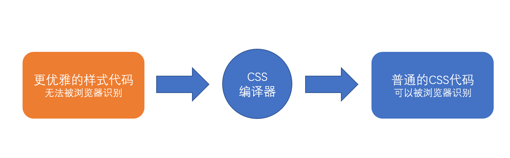

# CSS预编译器 {ignore}

## 基本原理

编写css时，受限于css语言本身，常常难以处理一些问题：

- 重复的样式值：例如常用颜色、常用尺寸
- 重复的代码段：例如绝对定位居中、清除浮动
- 重复的嵌套书写

由于官方迟迟不对css语言本身做出改进，一些第三方机构开始想办法来解决这些问题

其中一种方案，便是预编译器

预编译器的原理很简单，即使用一种更加优雅的方式来书写样式代码，通过一个编译器，将其转换为可被浏览器识别的传统css代码



目前，最流行的预编译器有**LESS**和**SASS**，由于它们两者特别相似，因此仅学习一种即可（`本课程学习LESS,它往往配合Vue`）


> less官网：http://lesscss.org/
> less中文文档1（非官方）：http://lesscss.cn/
> less中文文档2（非官方）：https://less.bootcss.com/
> sass官网：https://sass-lang.com/
> sass中文文档1（非官方）：https://www.sass.hk/
> sass中文文档2（非官方）：https://sass.bootcss.com/

## LESS的安装和使用

从原理可知，要使用LESS，必须要安装LESS编译器

LESS编译器是`基于node开发`的，可以通过npm下载安装

```shell
npm i -D less
```

安装好了less之后，它提供了一个CLI工具`lessc`(c:compile,编译)，通过该工具即可完成编译

```shell
npx lessc less代码文件 编译后放到哪个文件
```

试一试:

新建一个`index.less`文件，编写内容如下：

```less
// less代码
@red: #f40;

.redcolor {
    color: @red;
}
```

运行命令：

```shell
npx lessc index.less index.css
```

可以看到编译之后的代码：

```css
.redcolor {
  color: #f40;
}
```


## LESS的基本使用

具体的使用见文档：https://less.bootcss.com/

- 变量:@name

- 混合:
```less
.bordered{//如果写.bordered(@type:absolute){}也就是多加一对小括号,而且里面可以写一个变量,赋默认值
//那这个代码就不会在最终css代码中显示,但是其他调用这个类的地方还是会有它的代码,nb吧!
  border-top: 1px dotted black;
  border-bottom: 2px solid black;
}
#menu a{
  color:#111;
  .bordered();
}
.post a{
  color: red;
  .bordered();
}
//.bordered 类所包含的属性就将同时出现在 #menu a 和 .post a 中了。（注意，你也可以使用 #ids 作为 mixin 使用。）
```

- 嵌套
直接树形结构写嵌套就行了
```less
#header{
  color:black;

  &::before{//伪元素的写法,&::,也就是#header::before
    content:"aaa";
    display:block;
  }

  >.navigation{//加上>就是子了,而不是后代
    font-size:12px;
    .abc{
      color:red;
    }
  }
  .logo{
    width:300px;
  }
  li{
    margin:10px;
    &.selected{//li.selected

    }
  }
}
```

- 运算
```less
@width:500px
#header{
  width:@width*2 + 1em;//这两个单位不能互通,它会直接转为1001px;但是mm和cm可以互通
}
```

- 函数
有很多less内置函数，自行查看less函数手册吧
```less
@primary: #f40;
@some: #008c8c;
div{
  margin:if((2>1),0,3px);//如果为真，使用0,否则使用3px
  color:if((iscolor(@some)),@some,black);//判断@some是否是一种颜色,是则使用它，否则用black
}
.size(){
  height:100px;
  margin:10px 0;
}
.s1{
  background:@primary;
  color:#fff;
  .size();
}
.s2{//希望它的背景颜色在主颜色基础上加深,就用darken函数
  background:darken(@primary,20%);
  color:#fff;
  .size();
}
.s3{
  background:darken(@primary,40%);
  color:#ffff;
  .size();
}
```

- 作用域
跟js一样,我们不希望污染全局变量,它的变量会优先使用`最近的{}内的同名变量`
```less
@height:60px;
.header{
  @herght:56px;
  height:@height;
  .menu{
    height:@height;
  }
}
.abc{
  height:@height;
}
```

- 注释
```less
//单行注释===less注释,css不支持'//',所以不会显示到css文件里
/*
  多行注释===css注释,会显示到css文件里
*/
```

- 导入,不需要导出
也是模块化思想
```less
//common.less
@info:#333;
@danger:#f40;
@success:green;
@wran:brown;
.center(@type=absolute){
  positon:@type;
  left:50%;
  top:50%;
  transform:translate(-50%, -50%);
}

//index.less3
//如果是less,下面这一行导入语句不会出现在css文件中
@import "common" 
.test {
  color:@danger;
}
```
`如果导入的多个less,有样式冲突,或者后面的改变了前面的less文件的样式,则会覆盖。这样很好!方便我们!只是我们要注意导入顺序`


- 转义
> 转义（Escaping）允许你使用任意字符串作为属性或变量值。任何 `~"anything"` 或 `~'anything'` 形式的内容都`将按原样输出`，`除非 interpolation`。
```less
@min768: ~"(min-width: 768px)";
.element {
  @media @min768 {
    font-size: 1.2rem;
  }
}
```
编译为：
```less
@media (min-width: 768px) {
  .element {
    font-size: 1.2rem;
  }
}
```
`注意，从 Less 3.5 开始，可以简写为`：
```less
@min768: (min-width: 768px);
.element {
  @media @min768 {
    font-size: 1.2rem;
  }
}
```
在 Less 3.5+ 版本中，许多以前需要“引号转义”的情况就不再需要了。

- 命名空间和访问符
  - (不要和 CSS @namespace 或 namespace selectors 混淆了)。

> 有时，出于组织结构或仅仅是为了提供一些封装的目的，你希望对混合（mixins）进行分组。你可以用 Less 更直观地实现这一需求。假设你希望将一些混合（mixins）和变量置于 #bundle 之下，为了以后方便重用或分发：
```less
#bundle() {
  .button {
    display: block;
    border: 1px solid black;
    background-color: grey;
    &:hover {
      background-color: white;
    }
  }
  .tab { ... }
  .citation { ... }
}
```
现在，如果我们希望把 .button 类混合到 #header a 中，我们可以这样做：
```less
#header a {
  color: orange;
  #bundle.button();  // 还可以书写为 #bundle > .button 形式
}
```
注意：如果不希望它们出现在输出的 CSS 中，例如 #bundle .tab，请将 () 附加到命名空间（例如 #bundle()）后面。

- 映射
> 从 Less 3.5 版本开始，你还可以将混合（mixins）和规则集（rulesets）作为一组值的映射（map）使用。
```less
#colors() {
  primary: blue;
  secondary: green;
}

.button {
  color: #colors[primary];
  border: 1px solid #colors[secondary];
}
```
输出符合预期：
```css
.button {
  color: blue;
  border: 1px solid green;
}
```