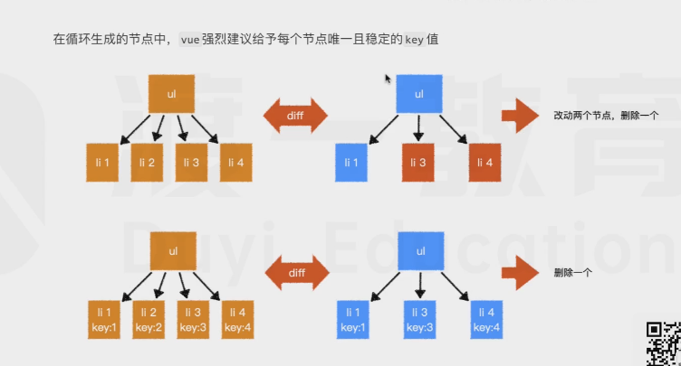

# 模板语法

## 内容

**vue中的元素 内容 使用 mustache 模板引擎进行解析**
mustache: https://github.com/janl/mustache.js

## 指令

指令(行间属性)会影响元素的渲染行为，指令始终以 v- 开头

基础指令:

1. v-for: 循环渲染/生成元素
2. v-html: 设置元素的innerHTML,该指令会导致元素的模板内容失效

3. `v-on: 注册事件`
    - 该指令由于十分常用,因此提供了简写 @
    - 事件支持一些指令修饰符,如 prevent(组织元素的默认元素), stop(阻止事件冒泡)
    - 事件参数会自动传递, 手动传参: $event
4.` v-bind: 绑定动态属性,单向绑定(用户的操作不会导致后台数据变化)`
    - 该指令由于十分常用,因此提供了简写 :

5. v-show: 控制元素可见度(并不改变DOM结构!)
6. v-if、v-else-if、v-else: 控制元素生成(虚拟DOM会改变)

7.` v-model: 双向数据绑定, 常用于表单元素`
    - 该指令是v-on和v-bind的复合板
    - 语法糖，用于实现双向绑定，实际上，是自动绑定了value属性值，和注册了`input`事件

进阶指令：

1. v-slot
2. v-text
3. v-pre
4. v-cloak
5. v-once
6. **自定义指定**


## 特殊属性
 
最重要的特殊属性: `key`(在虚拟节点里的属性)

**该属性可以干预diff算法,`在同一层级,key值相同的节点会进行比对`,key值不同的节点则不会**


`在循环生成的节点中,vue强烈建议给予每一个节点 唯一且稳定的 key值(不要用下标,用编号id)`



其他特殊属性：

ref、is、slot、slot-scope


## 计算属性

```js
computed:{
    //仅访问器
    prop(){
        return ...;
    },
    //访问器 + 设置器
    fullProp:{
        get(){
            return ...;
        },
        set(val){

        }
    }
}
```

计算属性和方法的区别：

1. 计算属性使用时，是当成属性使用，而方法是需要调用的
2. `计算属性会进行缓存，如果依赖不变，则直接使用缓存结果，不会重新计算,这就是优势`
3. 计算属性可以当成属性赋值，而方法不行
4. **凡是根据已有数据计算得到新数据的无参函数，都应该尽量写成计算属性，而不是方法**